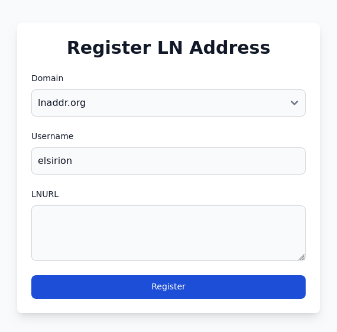
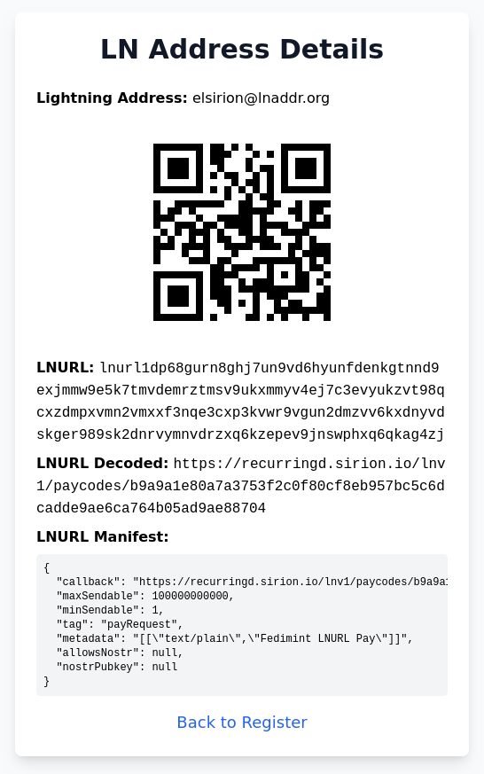

# `lnaddrd`: Simple Lightning Address Server

`lnaddrd` is a simple Lightning Address server that allows users to register Lightning Addresses (e.g., `user@lnaddr.org`) which forward incoming payments to the user's LNURL. This makes it easy to provide your own domains to users without also being their LNURL provider.

You can see a demo at https://lnaddr.org.

<div align="center">
  
  
</div>

## Features

- **Self-hosted Lightning Address server** written in Rust
- **User registration** for Lightning Addresses
- **Configurable domains** (serve multiple domains)
- **Embedded SQLite database** backend
- **Encrypted Nostr backups** recoverable from one stable root secret
- **Optional LUD-21-verified registration pricing** by username length
- **Resettable local administration UI** with reserved-name controls
- **Nostr service announcements and domain verification**
- **Environment variable configuration**
- **Nix/NixOS native deployment**

## Quick Start (with Nix)

### 1. Development Shell

To enter a development shell with all dependencies:

```sh
nix develop
```

This provides Rust, Diesel CLI, SQLite, and other tools.

### 2. Running locally

The dev shell comes with a range of useful `just` commands. Run `just` to see all of them.
The SQLite database is created and migrated automatically:

```sh
cargo run -- \
  --domains localhost \
  --database-path lnaddrd.sqlite3 \
  --root-secret-file root-secret \
  --admin-password-file admin-password \
  --nostr-relays wss://your-relay.example \
  initialize-empty

cargo run -- \
  --domains localhost \
  --database-path lnaddrd.sqlite3 \
  --root-secret-file root-secret \
  --admin-password-file admin-password \
  --nostr-relays wss://your-relay.example
```

For the full list of config options see `cargo run -- --help`:

```text
Usage: lnaddrd [OPTIONS]

Options:
      --domains <DOMAINS>...  One or more domain names to serve. Specify multiple times for multiple domains [env: LNADDRD_DOMAINS=]
      --bind <BIND>           The address to bind the server to [env: LNADDRD_BIND=] [default: 127.0.0.1:8080]
      --database-path <DATABASE_PATH>  Path to the SQLite database [env: LNADDRD_DATABASE_PATH=] [default: lnaddrd.sqlite3]
      --root-secret-file <ROOT_SECRET_FILE>  Stable service root secret [env: LNADDRD_ROOT_SECRET_FILE=]
      --admin-password-file <ADMIN_PASSWORD_FILE>  Resettable admin password [env: LNADDRD_ADMIN_PASSWORD_FILE=]
      --nostr-relays <NOSTR_RELAYS>...  Nostr backup relays [env: LNADDRD_NOSTR_RELAYS=]
      --public-base-url <PUBLIC_BASE_URL>  Canonical HTTPS announcement origin [env: LNADDRD_PUBLIC_BASE_URL=]
      --service-name <SERVICE_NAME>  Public announcement name [env: LNADDRD_SERVICE_NAME=]
      --warning <WARNING>     Warning displayed on registration page [env: LNADDRD_WARNING=]
  -h, --help                  Print help
```

### 3. Running with Docker

You can run `lnaddrd` using Docker. First, build the image (or pull from your registry if available):

```sh
docker build -t lnaddrd .
```

Or pull from GitHub Container Registry (if published):

```sh
docker pull ghcr.io/<your-username-or-org>/lnaddrd:latest
```

Then run the container, passing the required environment variables:

```sh
docker run -p 8080:8080 \
  -e LNADDRD_DOMAINS="yourdomain.com" \
  -e LNADDRD_BIND="0.0.0.0:8080" \
  -e LNADDRD_DATABASE_PATH="/var/lib/lnaddrd/lnaddrd.sqlite3" \
  -e LNADDRD_ADMIN_PASSWORD_FILE="/var/lib/lnaddrd/admin-password" \
  -e LNADDRD_NOSTR_RELAYS="wss://your-relay.example" \
  -e LNADDRD_PUBLIC_BASE_URL="https://yourdomain.com" \
  -v lnaddrd-data:/var/lib/lnaddrd \
  ghcr.io/<your-username-or-org>/lnaddrd:latest
```

- `LNADDRD_DOMAINS`: Comma-separated list of domains to serve (e.g., `lnaddr.org,lnaddr.net`)
- `LNADDRD_BIND`: Address to bind the server to (default: `0.0.0.0:8080` for Docker)
- `LNADDRD_DATABASE_PATH`: SQLite database path
- `LNADDRD_ROOT_SECRET_FILE`: Stable root-secret file; this is the critical backup material
- `LNADDRD_ADMIN_PASSWORD_FILE`: Resettable administrator-password file
- `LNADDRD_NOSTR_RELAYS`: Comma-separated Nostr backup relays
- `LNADDRD_PUBLIC_BASE_URL`: Canonical HTTPS origin; enables public service announcements
- `LNADDRD_SERVICE_NAME`: Human-readable name in announcements
- `LNADDRD_WARNING`: (Optional) Warning message for the registration page

Persist `/var/lib/lnaddrd` so the SQLite database survives container replacement.
See `docker-compose.yml` for an example.

### 4. NixOS Module

`lnaddrd` comes with a NixOS module for easy deployment. Example configuration:

```nix
let
  domains = [ "lnaddr.org" ]
in
{
  services.lnaddrd = {
    enable = true;
    domains = domains;
    databasePath = "/var/lib/lnaddrd/lnaddrd.sqlite3";
    nostrRelays = [ "wss://your-relay.example" ];
  };

  # Example NGINX reverse proxy
  services.nginx = {
    enable = true;
    recommendedTlsSettings = true;
    virtualHosts = builtins.listToAttrs (lib.map (domain: {
      name = domain;
      value = {
        forceSSL = true;
        enableACME = true;
        locations."/" = {
            # Default bind address, can be changed if it collides
            proxyPass = "http://127.0.0.1:8080";
          };
        };
      }) domains)
  };

  networking.firewall.allowedTCPPorts = [ 80 443 ];
}
```

### 5. Environment Variables

- `LNADDRD_DOMAINS`: Comma-separated list of domains to serve (e.g., `lnaddr.org,lnaddr.net`)
- `LNADDRD_BIND`: Address to bind the server to (default: `127.0.0.1:8080`)
- `LNADDRD_DATABASE_PATH`: SQLite database path (default: `lnaddrd.sqlite3`)
- `LNADDRD_ROOT_SECRET_FILE`: Root-secret path (default: `/var/lib/lnaddrd/root-secret`)
- `LNADDRD_ADMIN_PASSWORD_FILE`: Resettable admin-password path (default: `/var/lib/lnaddrd/admin-password`)
- `LNADDRD_NOSTR_RELAYS`: Comma-separated backup relay URLs
- `LNADDRD_PUBLIC_BASE_URL`: Canonical public HTTPS origin
- `LNADDRD_SERVICE_NAME`: Public service name (default: `lnaddrd`)
- `LNADDRD_WARNING`: Optional warning message for the registration page

## Database

`lnaddrd` uses SQLite. The database file and migrations are created automatically.
On an uninitialized database the HTTP server exposes only `/health/live` and
the authenticated setup pages below `/admin`; Lightning Address and public
registration routes remain unavailable. Log in and either generate a fresh
root seed or enter an existing seed to validate and restore its Nostr backup.
After setup succeeds, the process switches to normal service mode automatically.

The root-secret file is the only irreplaceable application state. Back it up
separately and keep it mode `0600`. The admin-password file is intentionally
resettable: remove or replace it and restart to invalidate existing sessions
without changing addresses or the Nostr identity.

```sh
# Inspect remote records without changing the target database
lnaddrd --domains yourdomain.com --database-path recovered.sqlite3 \
  --root-secret-file root-secret --nostr-relays wss://relay.example \
  restore --dry-run

# Rebuild an uninitialized SQLite file
lnaddrd --domains yourdomain.com --database-path recovered.sqlite3 \
  --root-secret-file root-secret --nostr-relays wss://relay.example restore
```

Normal resolution reads SQLite and remains available during a relay outage.
New mutations stay non-active until at least one relay acknowledges their
encrypted backup.

## Administration and payments

Open `/admin`, using the password stored at `LNADDRD_ADMIN_PASSWORD_FILE`.
If that file does not exist, lnaddrd creates it with mode `0600`; the default
location is `/var/lib/lnaddrd/admin-password`. Set the environment variable to
use another password file. The password is the only credential required to
enter first-run setup. It is resettable and is not recovery material.

On a running service, **Root seed backup** requires the current administrator
password again and downloads the 64-character seed as a `no-store` attachment.
Keep that export offline: possession of it controls the service identity and
decrypts all backed-up address metadata.

The UI configures exact reserved names and optional `max_length=price_msat`
tiers. A paid recipient must be an LNURL or Lightning Address supporting
LUD-21. Saving a policy requests an unpaid test invoice and validates its
unsettled verification response.

New services visibly reserve `_`, `admin`, `administrator`, `api`, `help`,
`info`, `lnurl`, `root`, `security`, `support`, and `www`; every entry can be
removed in the admin UI.

Paid attempts expire after 15 minutes. Settlement is checked server-side; the
browser cannot provide a receipt. If Nostr publication fails after payment,
the exact signed record remains queued and no second invoice is requested.

## Service discovery

With `LNADDRD_PUBLIC_BASE_URL` set, the server publishes a signed NIP-78
announcement and serves `/.well-known/lnaddrd.json`. Discover candidates from
an explicitly selected relay set with:

```sh
lnaddrd --nostr-relays wss://relay.example discover
lnaddrd --nostr-relays wss://relay.example discover --json
```

Discovery is not federation or failover. The command verifies current domain
control, but operators still require an independent trust policy.

## Legacy PostgreSQL import

Build the one-time importer with `--features postgres-import`. Stop the old
service, initialize the new SQLite service, run a dry run, then import:

```sh
cargo run --features postgres-import -- \
  --domains yourdomain.com --database-path lnaddrd.sqlite3 \
  --root-secret-file root-secret --nostr-relays wss://relay.example \
  import-postgres --database-url "$LNADDRD_DATABASE_URL" --dry-run
```

Legacy installations with invalid empty usernames or case-colliding names may
opt in to `--skip-empty-usernames` and `--prefer-newest-duplicates`. The latter
selects the greatest `updated_at` (then `created_at`) and reports every skipped
or superseded row in the signed import report.
`--canonicalize-usernames` explicitly lowercases, trims, and replaces runs of
legacy username whitespace with `-`; every changed username is also counted in
the report.

The importer reads but never mutates PostgreSQL, validates every row before
writing, hashes legacy management tokens with Argon2id, waits for relay
acknowledgement, and prints a signed redacted report. Keep PostgreSQL untouched
until the imported service has been checked; reruns skip already staged names.

## Protocol and architecture

The Nostr-recoverable SQLite architecture, optional LUD-21 payment
gate, administration model, and service-discovery protocol are documented in
the [design specification](docs/spec.md), with an incremental
[implementation plan](docs/implementation-plan.md). The companion protocol
documents define encrypted backup records and public service announcements.

## License

MIT
